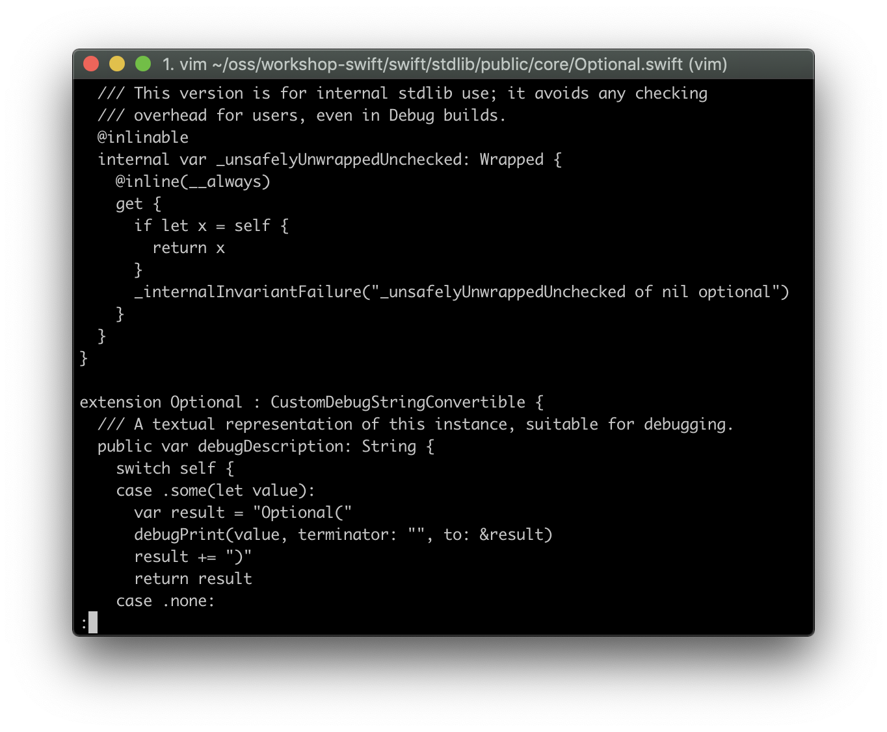

## Swift syntax highlighting in VIM

Being someone who spends almost 8/10ths of their programming life XCode (I don't actually know the fraction, but it feels that way) syntax highlighting for Swift is something that I take for granted, I'm entitled to syntax highlighting almost as if I was a syntax highlighting trust fund kid.
But then there are times when I feel like reaching for vim to edit a swift file and I have to leave XCode's safe harbor to take up a hand on the farm in vim, manual labor. To my syntax highlighting self entitled horror when I open up a swift file in vim I see this horror show:



Luckily Apple's open source Swift repository has a nice treat waiting for us in the utils/vim folder!
Try the following commands to install the syntax files where your vim installation can reach them, just copy the contents of the vim folder right on over:

``` shell
$ git clone --depth 1 https://github.com/apple/swift.git # a shallow clone will do
$ mkdir -p ~/.vim # make a vim folder if its not available already
$ cp -a ./swift/utils/vim/ ~/.vim # just copy over the contents of utils/vim as they are
$ rm -rf # this is just for cleanup
```

Then lastly ensure that the option for syntax highlighting is on in your `.vimrc` file:

`syntax on`

And if everything went ok and all is right with the world you should see this:


Isn't it beautiful?
